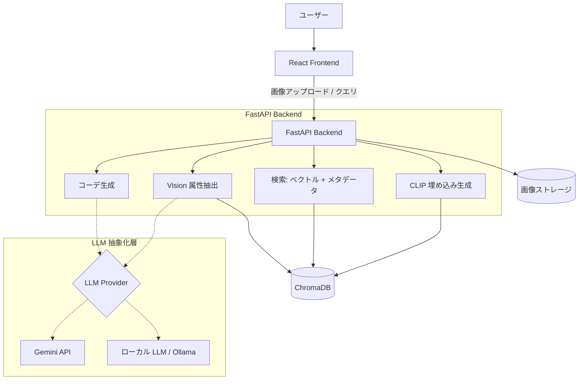
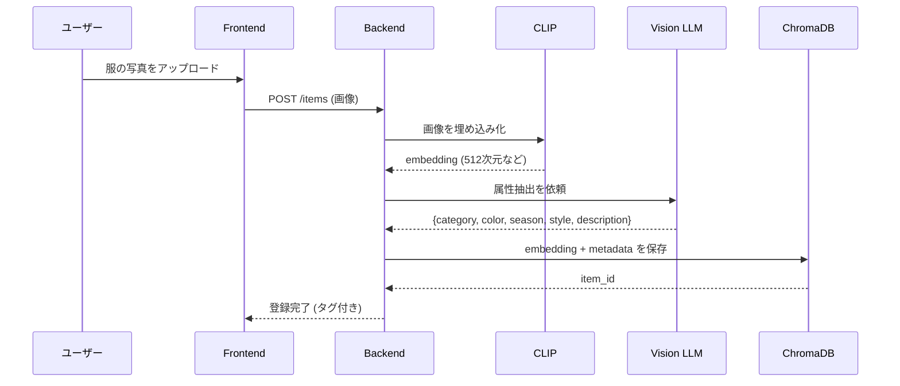
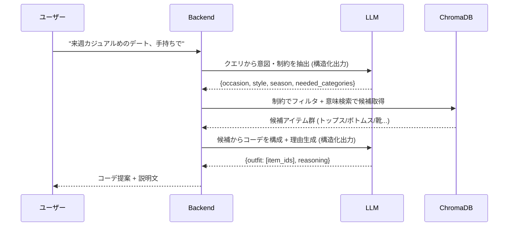

# ワードローブ管理・コーデ提案アプリ 設計ドキュメント

> **目的**: 手持ちの服を登録し、自然文（例:「来週カジュアルめのデート、手持ちで」）でコーデ提案を受けられる Web アプリ。
> **位置づけ**: マルチモーダル埋め込み / ベクトル検索 / LLM の構造化出力 を一通り触る学習プロジェクト。

---

## 1. コンセプトと学習目標

### コンセプト
自分のクローゼットをデジタル化し、「ML による検索」と「LLM による生成」を組み合わせて、状況に合ったコーディネートを提案する。

### このプロジェクトで身につくこと
| 領域 | 具体的な技術 |
|---|---|
| マルチモーダル ML | CLIP による画像埋め込み、ゼロショット分類 |
| ベクトル検索 | ChromaDB、メタデータフィルタ + 意味検索のハイブリッド |
| LLM 応用 | Vision による属性抽出、構造化出力（JSON スキーマ）、RAG 的な検索拡張生成 |
| 基盤の差し替え | Gemini API ↔ ローカル LLM（Ollama）をインターフェースで抽象化 |
| Web 実装 | 画像アップロード、非同期処理、API 設計 |

### 設計の肝（LLM × ML の役割分担）
```
CLIP 埋め込み (ML)      → 服どうしの「意味的な近さ」で検索・候補抽出
Gemini Vision (LLM)    → 服の属性をリッチに抽出（カテゴリ・色・季節・テイスト・説明文）
Gemini Text (LLM)      → 候補からコーデを構成し、理由を自然文で生成
自前分類器 (ML / 任意) → 拡張フェーズ。収集したタグでマルチラベル分類を学習し精度比較
```
CLIP（検索）と LLM（理解・生成）が別の役割を担うのがポイントです。同じ「服を見る」でも目的が違うため、両者が自然に共存します。

---

## 2. 機能要件

### MVP に含めるもの
1. **服の登録**: 写真をアップロード → 自動でタグ付け＋埋め込み化 → 保存
2. **一覧表示**: 登録済みアイテムをタグ付きで閲覧
3. **コーデ提案**: 自然文クエリ → 手持ちから組み合わせを選定＋理由を提示

### MVP では作らないもの（拡張フェーズへ）
- ユーザー認証 / マルチユーザー（MVP は単一ユーザー前提）
- 自前の分類モデル学習（最初は LLM Vision で代替）
- EC 連携 / 類似アイテム購入提案
- コーデの画像合成・着せ替え表示

> **方針**: まず「登録 → 検索 → 提案」の1本道を端から端まで通すことを最優先にします。

---

## 3. アーキテクチャ

### 3-1. システム全体構成


### 3-2. 服の登録フロー


### 3-3. コーデ提案フロー


### 3-4. バックエンド設計方針

バックエンドはクリーンアーキテクチャとDDD（ドメイン駆動設計）を設計ルールとして採用します。
服・コーデ・色・季節・利用シーンなどの業務概念を `domain` に集めます。

| レイヤ | 役割 | 置くもの |
|---|---|---|
| `domain` | アプリ固有の業務概念とルール | エンティティ、値オブジェクト、ドメインサービス |
| `application` | ユースケースの流れを表現 | 登録、一覧取得、コーデ提案などのユースケース、外部I/Oの抽象 |
| `presentation` | 外部からの入出力を変換 | FastAPIルート、Pydanticスキーマ、HTTPエラー変換 |
| `infrastructure` | 外部技術の具体実装 | ChromaDB、LLMクライアント、CLIP、画像ストレージ |
| `core` | アプリケーションの配線 | 設定、依存注入、FastAPIアプリ生成 |

依存方向は `presentation -> application -> domain` を基本とします。
`infrastructure` は `application` や `domain` が定義した抽象に対する実装を置き、`application` から `infrastructure` へ直接依存させません。
`core` は各レイヤを組み合わせる配線役として外側の実装を知ってよいですが、`domain` はFastAPI、Pydantic、ChromaDB、LLM SDKなどに依存させません。

DDDは以下を実装時の設計ルールとして守ります。

- `ClothingItem`、`Outfit`、`Season`、`StyleTag` など、コード上の名前をドメイン用語に揃える。
- 一意性とライフサイクルを持つ服やコーデはエンティティ、色・季節・利用シーンのように値で意味が決まるものは値オブジェクトとして扱う。
- 集約は整合性を守る境界として扱い、初期の主要集約は `ClothingItem` と `Outfit` を候補にする。
- 「トップスなしのコーデは作らない」「候補にない服を提案しない」などのドメインルールは `domain` に置く。
- API入力の形、HTTPステータス、Pydantic固有の制約は `presentation` に閉じ込める。
- API入出力スキーマ、設定、外部I/Oの検証には Pydantic v2 を使う。`domain` のエンティティ、値オブジェクト、ドメインルールには Pydantic を持ち込まず、通常のclassで表現する。
- ChromaDBやLLM呼び出しは `infrastructure` に置き、ユースケースからは抽象を通して利用する。

---

## 4. 技術選定

| レイヤ | 採用 | 理由 |
|---|---|---|
| Frontend | React + Vite（または Next.js） | 画像アップロード UI が組みやすい。軽く始めるなら Vite |
| Backend | FastAPI (Python) | CLIP など ML ライブラリが Python 中心。型安全 & 非同期に強い |
| 画像埋め込み | CLIP (`sentence-transformers` の `clip-ViT-B-32`) | 画像↔テキストを同一空間に埋め込め、検索に最適。OSS でローカル完結 |
| Vector DB | ChromaDB | 軽量・ローカル起動が容易。メタデータフィルタ + 類似検索を両立 |
| LLM（タグ付け・生成） | Gemini Flash 系（2.0 / 2.5 Flash） ＋ ローカル LLM 差し替え可 | Vision 品質と構造化出力が安定。無料枠で素早く試せる |
| 画像ストレージ | ローカル FS（MVP）→ GCS（拡張） | MVP は最小構成で十分 |

### Gemini と ローカル LLM の使い分け
| 観点 | Gemini API | ローカル LLM (Ollama) |
|---|---|---|
| Vision 品質 | 高い | 中（LLaVA / Qwen-VL 系、改善中） |
| 構造化出力 | `response_schema` で安定 | `format: json` 等、やや不安定 |
| コスト | 無料枠あり / 従量 | 無料（GPU・電気代） |
| オフライン | × | ○ |
| セットアップ | API キーのみ | モデル DL・GPU 必要 |
| 学習価値 | API 設計の練習 | 推論基盤の理解 |

> **推奨**: まず **Gemini** で動く MVP を作り、その後ローカル LLM に差し替えて推論基盤を学ぶ。そのために **`LLMProvider` インターフェース**を切り、`generate_structured()` / `vision_extract()` を実装ごとに差し替えられるようにします。日本語の服飾語彙が気になる場合は、埋め込みを日本語 CLIP（`rinna/japanese-clip-vit-b-16` や `stabilityai/japanese-stable-clip` 系）に替える選択肢もあります。

### 日本語の埋め込みについての補足
英語 CLIP でも画像ベースの検索は機能しますが、テキスト側（クエリ）を日本語で扱うなら日本語対応 CLIP を検討すると精度が上がります。MVP は英語 CLIP で開始し、必要に応じて差し替えるのが手堅いです。

---

## 5. データモデル

```python
# 服アイテム1件のスキーマ（Pydantic イメージ）
class ClothingItem(BaseModel):
    id: str
    image_path: str
    category: Literal["tops", "bottoms", "outerwear", "shoes", "accessory"]
    colors: list[str]          # 例: ["navy", "white"]
    seasons: list[str]         # 例: ["spring", "autumn"] ※マルチラベル
    style_tags: list[str]      # 例: ["casual", "clean"]
    description: str           # LLM が生成した自然文の説明
    # embedding は ChromaDB 側に格納（metadata と紐付け）
```

### ChromaDB への格納
- **embedding**: CLIP のベクトル → 意味検索に使用
- **metadata**: `category` / `seasons` / `style_tags` など → フィルタに使用
- **document**: `description` → 検索結果の可読化・LLM への入力に使用

> 「フィルタ（メタデータ）で候補を絞り、意味検索（embedding）で並べ替える」ハイブリッド検索が肝になります。

---

## 6. コアロジック詳細

### 6-1. 自動タグ付け（LLM Vision）
画像を Gemini Vision に渡し、**構造化出力（JSON スキーマ指定）**で属性を取得します。自由記述ではなくスキーマで縛ることで、後段のフィルタに使える綺麗なデータになります。

- 入力: 服の画像
- 出力（例）: `{ "category": "tops", "colors": ["navy"], "seasons": ["spring","autumn"], "style_tags": ["casual","clean"], "description": "ネイビーの無地クルーネックT..." }`

### 6-2. 埋め込み・ベクトル検索（CLIP + Chroma）
- 登録時: 画像を CLIP で埋め込み、Chroma に保存
- 検索時: クエリ（テキスト or 抽出した制約）を埋め込み、近傍探索 + メタデータフィルタ

### 6-3. コーデ提案（2 段階の LLM 呼び出し）
1. **意図抽出**: 自然文クエリ → `{occasion, style, season, needed_categories}` を構造化出力
2. **候補取得**: 上記制約で Chroma を検索し、カテゴリごとに候補を集める
3. **コーデ構成**: 候補リスト（説明文付き）を LLM に渡し、`{outfit: [item_ids], reasoning}` を構造化出力で生成

> これは **RAG の応用**です。「検索 = 手持ち服から候補を絞る」「生成 = LLM がコーデを組み立て理由を述べる」という対応になります。手持ちにないアイテムを勝手に提案させない（item_id を候補内に制約する）のが品質のポイントです。

---

## 7. 開発ロードマップ

> 時間はあくまで目安（個人開発・パートタイム想定）。各マイルストーンで「端から端まで動く」状態を作るのを優先します。

### 環境構築（1〜2 日）
- リポジトリ作成、FastAPI / React のスケルトン
- ChromaDB をローカル起動、Gemini API キー取得（or Ollama セットアップ）
- 「フロント → バック → 固定文字列を返す」最小疎通

### アイテム登録パイプライン（3〜5 日）
- 画像アップロード（Frontend → Backend → ストレージ）
- CLIP 埋め込み生成
- Gemini Vision による属性抽出（構造化出力）
- Chroma へ embedding + metadata を保存
- 登録済みアイテムの一覧表示
- ✅ 完了基準: 写真を上げると自動でタグが付いて一覧に並ぶ

### コーデ提案（3〜5 日）
- 自然文クエリ入力 UI
- 意図抽出（構造化出力）
- 候補取得（ベクトル検索 + メタデータフィルタ）
- コーデ構成 + 理由生成（構造化出力）
- 提案結果の表示（選ばれたアイテム + 説明）
- ✅ 完了基準: クエリに対し手持ちからコーデと理由が返る

### UI / UX 改善（任意）
- ギャラリーの見栄え、コーデの並べ表示、提案履歴

### 拡張（ML 深掘り・分散構成・任意）
- **自前マルチラベル分類器**: アイテム登録で貯めたタグを教師に分類モデルを学習し、CLIP ゼロショット / Gemini Vision と精度比較（ここが Kaggle 的な腕の見せどころ）
- **類似アイテム検索 → EC 連携**: 埋め込み近傍で「似た服」を探す
- **ローカル LLM へ差し替え**: `LLMProvider` 実装を切り替え、推論基盤を学ぶ。単一ユーザー・軽量なら Ollama（GGUF・量子化・セットアップ容易）、スループット最適化や本番運用・同時リクエストを学ぶなら vLLM（PagedAttention・continuous batching、要 GPU）。構造化出力は Ollama=`format:json`、vLLM=guided decoding で対応
- **Go への切り出し（API / オーケストレーション層）**: 動いた MVP から、API・LLM 呼び出し・検索オーケストレーションを Go サービスに分離し、Python は ML 推論（CLIP・分類器）専任に。境界は「torch モデルを読む=Python、それ以外=Go」。サービス間は REST/JSON か gRPC、画像受け渡しは共有ストレージにパス渡しが楽。Vector DB は Go 公式クライアントのある Qdrant への置換も検討。goroutine による並行処理・サービス間通信・独立スケールを学ぶ
- **評価**: 提案の質をどう測るか（後述）

> **本プロジェクトの方針（確定）**: まず All-Python（FastAPI）で MVP を端から端まで通し、動作確認できてから上記の Go 切り出しに着手する。greenfield で分散構成を組むより、実物のサービス境界を見ながら「何を Go に出すか」を判断でき、学習効果が高い。本アプリの体感レイテンシは LLM / 埋め込みが支配的で、API 層の言語差は誤差のため、Go 化の主目的は性能ではなく分散構成の習得に置く。

---

## 8. ディレクトリ構成（例）

```
wardrobe-app/
├── backend/
│   ├── app/
│   │   ├── main.py
│   │   ├── domain/           # エンティティ、値オブジェクト、ドメインルール
│   │   │   ├── item.py
│   │   │   ├── outfit.py
│   │   │   └── value_objects.py
│   │   ├── application/      # ユースケース、外部I/Oの抽象
│   │   │   ├── register_item.py
│   │   │   ├── suggest_outfit.py
│   │   │   └── ports.py
│   │   ├── presentation/     # FastAPIルート、Pydanticスキーマ
│   │   │   └── api/
│   │   │       ├── routes.py
│   │   │       └── schemas.py
│   │   ├── infrastructure/   # ChromaDB、LLM、CLIP、画像ストレージ実装
│   │   │   ├── chroma_item_repository.py
│   │   │   ├── gemini_llm_client.py
│   │   │   ├── clip_embedding_service.py
│   │   │   └── local_image_storage.py
│   │   └── core/             # 設定、依存注入、アプリ配線
├── frontend/
│   └── src/
│       ├── components/
│       ├── pages/
│       └── api/              # バックエンド呼び出し
├── pyproject.toml
└── compose.yaml              # 任意（Chroma 等をまとめる）
```

---

## 9. 学習ポイント・つまずきやすい点

- **構造化出力の安定化**: 自由記述に頼ると後段が壊れます。スキーマ指定（Gemini の `response_schema`）を最初から使うのが安定への近道。
- **ハイブリッド検索の設計**: メタデータフィルタと意味検索のバランス。「靴は靴の中から探す」などカテゴリ制約を効かせないと変なコーデになります。
- **ハルシネーション対策**: コーデ生成時、LLM が手持ちにないアイテムを作らないよう、候補 `item_id` の範囲内に出力を制約する。
- **CLIP の限界**: 細かい柄・素材感までは捉えきれないことがある。だからこそ LLM Vision の説明文が補完として効きます。
- **評価の難しさ**: コーデ提案は「正解」が一意でない。MVP では自分で使って体感評価、拡張で「カテゴリの整合」「制約の充足率」など簡易指標を設けると客観性が出ます。
